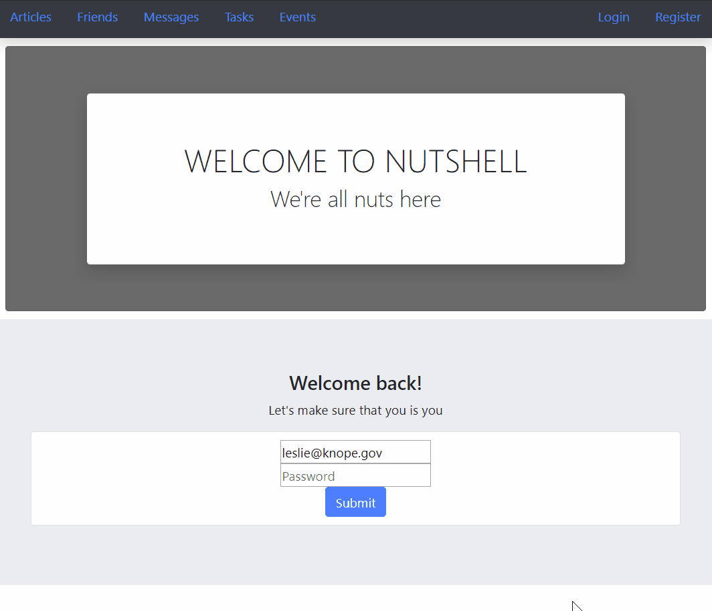

# Reactive Nutshell: The Information Dashboard

## What is Reactive Nutshell?

Nutshell is a new product offering that you have been tasked with building. It's an app for people to use to organize their daily tasks, events, news article, friends, and chat messages.

## Setup: Follow these steps exactly

1. Clone this repository
1. `cd` into the directory it creates
1. In the `api` directory, create a copy of the `database.json.example` and remove the .example extension.
1. Run `npm install` and wait for all dependencies to be installed
1. Run `npm start` to verify that installation was successful.

## Running Your Server

1. Open another terminal window and navigate to the `api` folder within `src`
1. Run `json-server -p 5002 -w database.json`

## Using the App

1. In the browser, navigate to `localhost:3000`
1. If you have never used Nutshell before, `Register` a new account
1. If you are a returning user, `Login` with your account information
1. Add new `articles`, `friends`, `messages`, `tasks`, and `events`
1. See your friends shared `articles` and `events`
1. Go Nuts!

## ERD

---
&copy;2019 - Trey Suiter, Ryan Crowley, Guy Cherkesky, Ryan Bishop